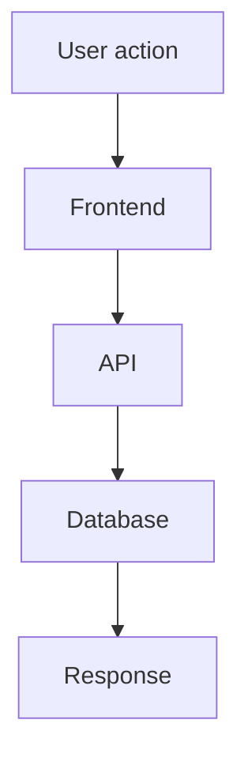

## Description

<!--
Describe your changes from a user's perspective - no technical jargon.
Think of this as a release note that anyone can understand.
Focus on what users can see or do differently after this change.
Examples:
- "Users can now import vocabulary lists from CSV files"
- "Fixed login page that was crashing on Safari"
- "Added dark mode toggle to settings"
-->

## Technical Changes

<!--
Summarize all technical changes in bullet points.
Be specific about files, components, APIs, and database changes.
This helps reviewers understand the scope and impact quickly.
Examples:
- Added `VocabularyImport` component in `src/components/vocabulary/import.tsx`
- Created API route `/api/vocabulary/import` in `src/app/api/vocabulary/import/route.ts`
- Added `vocabulary_lists` table with migration `0001_add_vocabulary_lists.sql`
- Updated `db/schema.ts` with new vocabulary list schema
-->

## Flow Diagram (Optional)

<!--
If your changes involve complex workflows (multiple steps, API calls, external services),
create a Mermaid diagram to illustrate the implementation flow.
This helps reviewers understand the architecture and data flow.
-->

